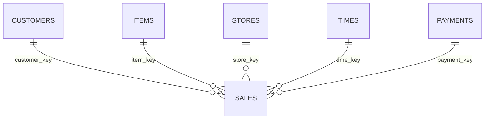
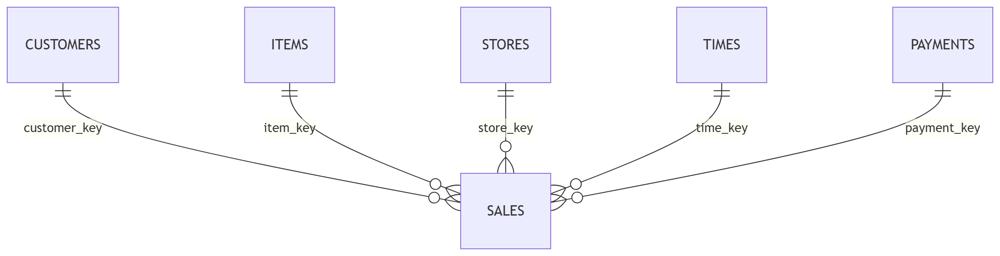

# Modelo de Datos en MongoDB

## 1. Descripción general

El dataset original está compuesto por una tabla de hechos y cinco dimensiones.

La información fue migrada a MongoDB manteniendo una estructura referenciada para evitar duplicación innecesaria de datos y facilitar el análisis mediante Aggregation Pipelines.

## 2. Correspondencia entre archivos y colecciones

| Archivo CSV      | Colección MongoDB |
| ---------------- | ----------------- |
| customer_dim.csv | customers         |
| item_dim.csv     | items             |
| store_dim.csv    | stores            |
| time_dim.csv     | times             |
| Trans_dim.csv    | payments          |
| fact_table.csv   | sales             |

## 3. Colecciones

### customers

Contiene la información de clientes.

Clave principal:

`customer_key`

El campo original `coustomer_key` fue normalizado a `customer_key`.

### items

Contiene la información de productos.

Clave principal:

`item_key`

También se normalizaron los nombres:

- `desc` → `description`
- `man_country` → `manufacturing_country`

### stores

Contiene la información geográfica de las tiendas.

Clave principal:

`store_key`

### times

Contiene la dimensión temporal de las ventas.

Clave principal:

`time_key`

El campo `date` fue convertido desde texto a un tipo Date antes de almacenarse en MongoDB.

### payments

Contiene información sobre los métodos de pago.

Clave principal:

`payment_key`

El campo `trans_type` fue normalizado a `transaction_type`.

### sales

Es la colección principal y contiene los hechos de venta.

Campos de referencia:

- `customer_key`
- `item_key`
- `store_key`
- `time_key`
- `payment_key`

Medidas principales:

- `quantity`
- `unit`
- `unit_price`
- `total_price`

## 4. Relaciones

## 5. Modelo elegido

Se utilizó un modelo referenciado.

En lugar de almacenar dentro de cada documento de sales toda la información del cliente, producto, tienda, fecha o método de pago, se almacenan únicamente las claves necesarias para relacionar cada venta con las colecciones correspondientes.

Por ejemplo, una venta contiene:

{
"customer_key": "C004510",
"item_key": "I00001",
"store_key": "S0001",
"time_key": "T049189",
"payment_key": "P026",
"quantity": 1,
"unit_price": 35.0,
"total_price": 35.0
}

Mientras que la información descriptiva del cliente se mantiene una sola vez dentro de customers.

Este enfoque permite:

- reducir duplicación de información
- mantener una estructura más ordenada
- evitar repetir atributos descriptivos en cada venta
- conservar consistencia entre los datos
- facilitar relaciones mediante Aggregation Pipelines y $lookup.

Se decidió no utilizar un modelo completamente embebido porque atributos como nombres de clientes, productos, proveedores o ubicaciones podrían repetirse miles de veces dentro de sales.

## 6. Calidad e integridad de datos

Antes de realizar la carga a MongoDB se ejecutó un proceso de perfilamiento y validación sobre los archivos CSV.

### Duplicados

No se encontraron filas completamente duplicadas en ninguno de los archivos analizados.

También se verificó que las claves principales de las dimensiones fueran únicas.

Resultados:

customer_dim.coustomer_key: 0 duplicados
item_dim.item_key: 0 duplicados
store_dim.store_key: 0 duplicados
time_dim.time_key: 0 duplicados
Trans_dim.payment_key: 0 duplicados

### Claves nulas

No se encontraron valores nulos en las claves principales utilizadas para relacionar las dimensiones con la tabla de hechos.

Esto permite mantener correctamente la identificación de cada entidad.

### Integridad referencial

Se validó que todas las referencias presentes en fact_table.csv existieran en sus respectivas dimensiones.

Resultados:

fact_table.coustomer_key: 0 referencias inexistentes
fact_table.item_key: 0 referencias inexistentes
fact_table.store_key: 0 referencias inexistentes
fact_table.time_key: 0 referencias inexistentes
fact_table.payment_key: 0 referencias inexistentes

Por lo tanto, no se detectaron referencias huérfanas.

### Valores nulos detectados

Durante la inspección se encontraron los siguientes valores nulos:

customer_dim.name: 27
item_dim.unit: 1
fact_table.unit: 3,723
Trans_dim.bank_name: 1

No todos los valores nulos fueron considerados errores.

El valor nulo encontrado en bank_name corresponde a una transacción de tipo cash, por lo que se considera coherente con el contexto de negocio.

Los demás valores nulos se conservaron para no modificar de manera arbitraria la información original.

### Reglas básicas de negocio

También se realizaron validaciones sobre las medidas transaccionales.

Resultados:

Totales inconsistentes: 0
Cantidad menor o igual a 0: 0
Precio unitario negativo: 0
Precio total negativo: 0
Meses fuera del rango 1-12: 0
Trimestres inválidos: 0

Se verificó que:

total_price = quantity \* unit_price

para todas las transacciones, considerando una tolerancia mínima para posibles diferencias decimales.

### Validación de carga

Después de cargar la información en MongoDB, se comparó la cantidad de registros de los archivos CSV con la cantidad de documentos almacenados en cada colección.

Resultados:

| Colección   |       CSV |   MongoDB | Estado |
| ----------- | --------: | --------: | ------ |
| `customers` |     9,191 |     9,191 | OK     |
| `items`     |       264 |       264 | OK     |
| `stores`    |       726 |       726 | OK     |
| `times`     |    99,999 |    99,999 | OK     |
| `payments`  |        39 |        39 | OK     |
| `sales`     | 1,000,000 | 1,000,000 | OK     |

La cantidad de documentos cargados coincide con la cantidad de registros del origen.

## 7. Índices

Se crearon índices para mejorar el rendimiento de las consultas y mantener la unicidad de las claves principales.

### Índices únicos en dimensiones

Se crearon índices únicos sobre:

customers.customer_key
items.item_key
stores.store_key
times.time_key
payments.payment_key

Estos índices garantizan que una misma clave no pueda repetirse dentro de su colección.

### Índices en sales

La colección sales contiene 1,000,000 documentos.

Debido a que las consultas analíticas utilizarán frecuentemente las claves de referencia para filtros y relaciones, se crearon índices sobre:

- customer_key
- item_key
- store_key
- time_key
- payment_key

Los índices creados son:

- ix_sales_customer_key
- ix_sales_item_key
- ix_sales_store_key
- ix_sales_time_key
- ix_sales_payment_key

Estos índices no son únicos porque un mismo cliente, producto, tienda, fecha o método de pago puede aparecer en múltiples ventas.
